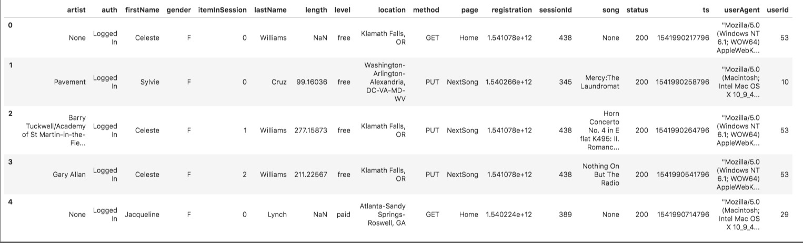
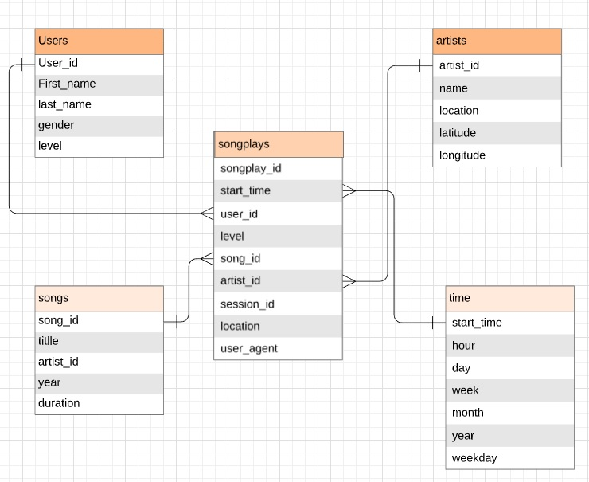
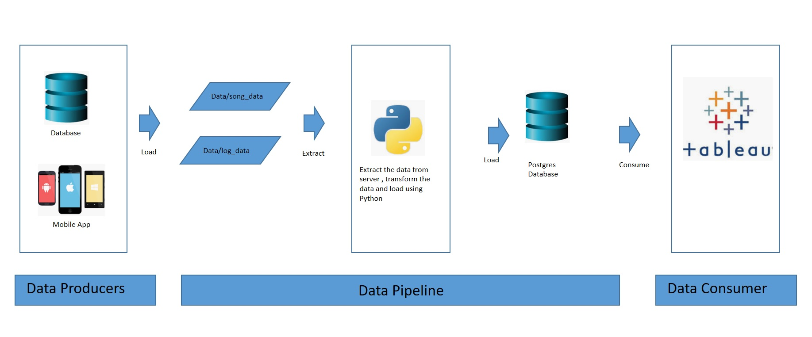
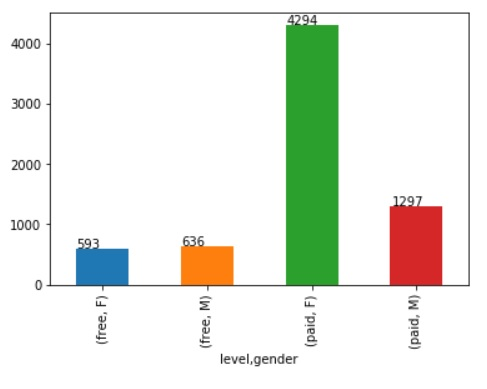
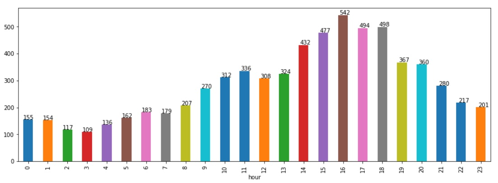
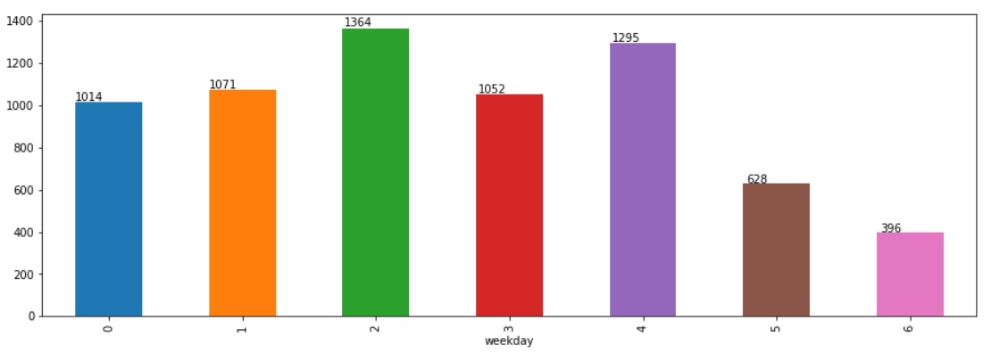

# Project: Data Modeling with Postgres
## Introduction
A startup called Sparkify wants to analyze the data they've been collecting on songs and user activity on their new music streaming app. The analytics team is particularly interested in understanding what songs users are listening to. 

They'd like a data engineer to create a Postgres database with tables designed to optimize queries on song play analysis. 

## Project Description
In this project, create a database schema and ETL pipeline for this analysis. Do data modeling with Postgres and build an ETL pipeline using Python. To complete the project, define fact and dimension tables for a star schema for a particular analytic focus, and write an ETL pipeline that transfers data from files in two local directories into these tables in Postgres using Python and SQL.

## Data 

The Data resides in a directory of JSON logs on user activity on the app, as well as a directory with JSON metadata on the songs in their app.

### Song Dataset

The first dataset is a subset of real data from the Million Song Dataset. Each file is in JSON format and contains metadata about a song and the artist of that song. The files are partitioned by the first three letters of each song's track ID. For example, here are filepaths to two files in this dataset.

And below is an example of what a single song file, TRAABJL12903CDCF1A.json, looks like.

*{"num_songs": 1, "artist_id": "ARJIE2Y1187B994AB7", "artist_latitude": null, "artist_longitude": null, 
"artist_location": "", "artist_name": "Line Renaud", "song_id": "SOUPIRU12A6D4FA1E1", "title": "Der Kleine Dompfaff", "duration": 152.92036, "year": 0} *

### Log Dataset

The second dataset consists of log files in JSON format generated by this event simulator based on the songs in the dataset above. These simulate activity logs from a music streaming app based on specified configurations.

The log files in the dataset are partitioned by year and month. For example, here are filepaths to two files in this dataset.
log_data/2018/11/2018-11-12-events.json
log_data/2018/11/2018-11-13-events.json

And below is an example of what the data in a log file, 2018-11-12-events.json, looks like.

## Database schema

### Tables
Below are the tables need to be defined

1. Fact Table
 1. songplays - records in log data associated with song plays i.e. records with page NextSong
  -  songplay_id, start_time, user_id, level, song_id, artist_id, session_id, location, user_agent
2. Dimension Tables
 1. users - users in the app
  -  user_id, first_name, last_name, gender, level
 2. songs - songs in music database
  -  song_id, title, artist_id, year, duration
 3. artists - artists in music database
  -  artist_id, name, location, latitude, longitude
 4. time - timestamps of records in songplays broken down into specific units
  -  start_time, hour, day, week, month, year, weekday

### ER Diagram

ER diagram depicting the tables.

## Data Pipeline

Below shows how we are going to design the pipeline

## Scripts which does the job

### sql_queries.py 
    contains all your sql queries, and is imported into the create_tables, etl.py and etl.ipynb
    last three files above.
    
### create_tables.py
    drops and creates your tables. You run this file to reset your tables before each time you run your ETL scripts.
    
    how to run :  python create_tables.py

### etl.py
    etl.py reads and processes files from song_data and log_data and loads them into your tables. You can fill this out based on your work in the ETL notebook.
    
    how to run :  etl.py
    
### etl.ipnb and test.ipynb
    Beloe are two test scripts
    
    etl.ipynb reads and processes a single file from song_data and log_data and loads the data into your tables. 
    This notebook contains detailed instructions on the ETL process for each of the tables.
    
    test.ipynb displays the first few rows of each table to let you check your database.
    
    hot to run : ctrl+enter (to run each cell) or Run -> Run All ( for running all the cells.)

## Some of Analysis on the songs plays

### Chart showing songs streamed by level and gender

Insights: 

    Female users are stream songs more than male users
    Paid users stream more than free users
    

### Chart showing songs on a particular hour

Insights:
    
    Most of songs are streamed from 10 am to 9 pm and 4 pm being the most streamed hour

### Chart showing songs streamed on a weekday

Insights:
    
    Songs streaming increases from Monday(0) and gradually decresing on weekends( 5, 6). 
    Most of the songs streamed on wednesday(2)
    